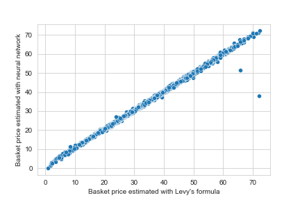
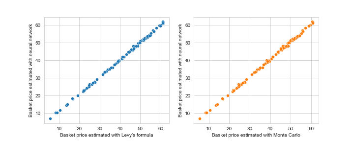
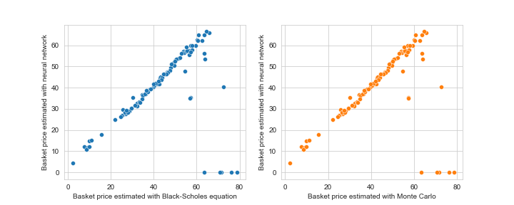
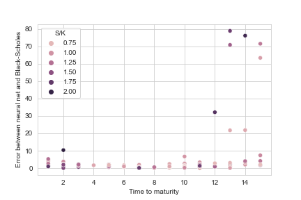

# Comparison of neural network, numerical solver, and classic analytical approximations for European basket options pricing 

The goals of this project are: 1) build an artifical neural network to price European basket options, and 2) compare it to a Monte Carlo solver and a closed form analytical equation for single-asset option pricing. For brevity, I limited this analysis to call options. Throughout, I consider 4-asset basket options, although the code is flexible and can consider a wide range of asset numbers, prices, and relative weights within the basket.

---

**Summary of results**:

In the below table I show the mean absolute error with min and max values for 4-asset basket options pricing (except the last column, which is single-asset). 
|                                 | Ground truth (Levy's formula, n=2000) |         Monte Carlo (n=100)         | Black-Scholes (single-asset option, n=100)* |
|:-------------------------------:|:-----------------------------:|:---------------------------:|:------------------------------------:|
| Neural network  mean abs. error |  0.554, range=[4.41e-4, 33.9] | 0.85, range=[2.15e-2, 2.06] |      6.10, range=[1.11e-3, 78.8]     |

\* take this comparison with a grain of salt. Instead of re-training the neural net for single-asset options, I "tricked" the 4-asset options pricing neural network into pricing single-asset options. See below for more details.

One reason for a client to want to use a neural net is the potential acceleration of pricing. Below I'm showing the time in seconds to price a single 4-asset basket option, averaged over 100 runs.

|                                                                     | Analytical approx. (Levy's formula) | Monte Carlo  (2mil simulated paths) | Neural network |
|:-------------------------------------------------------------------:|:-----------------------------------:|:-----------------------------------:|:--------------:|
| Time to price one 4-asset basket option  (averaged across 100 runs) |             1.648e-3 sec            |             5.461e-1 sec            |  4.309e-2 sec  |

**Conclusion**: Neural network models may be feasible for accelerated pricing of European basket options. I observed low error relative to both the ground truth simulated basket options prices (~1.5% error) and the Monte Carlo solver (~2.4% error). Without re-training the 4-asset option pricing neural network, I observed modest error (albeit many outliers) on single-asset options using a principled "trick" to derive appropriate inputs for the 4-asset network. Across all cases, performance outliers seemed to be related to the simulated options with parameters that fell near the extremes of the possible values, especially with respect to price-to-strike ratio and time-to-maturity. The neural network model was ten times faster than the Monte Carlo solver, but approx. ten times slower than the analytical approximation using Levy's formula. Neural networks may have applications in regimes where the assumptions underlying analytical approximations do not hold and the derivative is too complex for reasonable Monte Carlo times (this assumes adequate training data). Future, real-world applications should seek out real historical pricing data for training and should be wary of applying neural network models to out-of-distribution data for exotic derivatives pricing.

---
 
*Further details:*

This is a *proof-of-concept* of an accelerated options pricing model. Therefore, I used simulated data to train the network. Levy's 1992 moment matching method was used to generate simulated basket option prices; Levy's formula assumes homogenous volatility of the underlying assets, and no volatility skew for deep in-the-money or out-of-the-money options. To realize the advantages of a neural network approach in a real-world setting--which could include accurately modelling behaviour that violates Black-Scholes--we would want to collect a large dataset of historical option prices. Without training on historical data, the limitations of the neural network model will almost certainly be the same as the limitations of Levy's formula.

This analysis was organized as follows:
1. Simulate approximate prices of 10,000 European 4-asset basket options using Levy's formula.
1. Train a fully-connected artifical neural network to estimate option prices using prices, weights, and other relevant inputs.
1. For a subset of the testing data, compare option prices from the neural network model with those from a Monte Carlo solver.
1. Compare the neural network with Black-Scholes on single-asset options. Instead of re-training the network for single-asset options, I used a "trick" to allow single-asset option pricing with the neural network trained on 4-asset baskets. I did this by inputting the price of the single asset as all prices in the 4-asset network, with very small weights for the last 3 assets. E.g. for an single-asset option with an asset price of 100, I input prices=[100,100,100,100] and weights=[0.997, 0.001, 0.001, 0.001] into the network.

In each analysis, the base properties of the 4-asset basket option were:

* prices = [100,100,100,100]
* volatility = [0.4,0.4,0.4,0.4]
* off-diag correlations = 0.5
* strike price = 100
* risk-free interest rate = 0.

During simulation, all but the correlation matrix and the interest rate had noise added for each realization. The constant correlation matrix is a limitation of this work, and future efforts will benefit from incorporating the correlations into the neural network inputs. Other relevant parameters were random uniforms across a range of reasonable values. See the pairplots in *main_analysis.ipynb* for insight into all distributions. See the bottom of this README for specific details in the random noise added to these parameters and other important parameters like basket weights and time-to-maturity.

Brief results follow. For full details of the analysis, see *main_analysis.ipynb*.

## 2. Comparison of neural network with ground truth (Levy's formula) on test data (n=2000) 

The model architecture was inspired by Ke & Yang 2019 (capstone project for Stanford CS230). I used a 4-layer fully-connected network with 256 nodes and batch norm in the first three layers, and a 1-node final layer. All layers used a ReLU activation function. The input features were normalized before network processing. The model had 4+2(N_assets) input features:
* N features for the price of each asset
* N features for the weight of each asset in the basket
* Strike price
* Maturity date
* Volatility (all assets have equal volatility for the Levy formula)
* Risk-free interest rate (set to zero for simplicity)

Training was performed with the Adam optimizer (default TF settings) on a mean-squared error loss function for 100 epochs. 

The figure below shows the option price estimated by the network (vertical axis), relative to the ground truth (horizontal axis). The network performs well. It is noteworthy that the two outliers had both the maximum possible time-to-maturity (15) and a fairly high price-to-strike ratio.

## 3. Comparison of neural network with Monte Carlo solver on subset of test data (n=100)

Since these options are path-independent, I just simulated the final state of the random walk. Therefore, I was able to simulate a substantial number of price paths (2,000,000). 

I ran the Monte Carlo solver on a subset of the test set of simulated 4-asset basket options (n=100). In the figures below, I'm showing the neural net prices (both vertical axes) against the training ground truth (Levy's formula; left subplot) and against the Monte Carlo prices (right subplot).

## 4. Comparison of neural net, Monte Carlo, and Black-Scholes on single-asset options

Since Levy's formula reduces to Black-Scholes in the single-asset limit, I imagine re-training the network on single-asset options would show performance quite similar to section 2 above. As mentioned above, I therefore thought it would be more interesting to attempt to re-use the 4-asset neural network on this single-asset problem. I did this by using the price of the single asset as input for all 4 prices in the network, and I assigned very small weights to the three "synthetic" assets. E.g. for a single-asset option with an asset price of 100, I input prices=[100,100,100,100] and weights=[0.997, 0.001, 0.001, 0.001] into the network.

Similarly to above, I simulated n=100 single-asset options. In the figures below, I'm showing the neural net prices (both vertical axes) against the Black-Scholes price (left subplot) and against the Monte Carlo prices (right subplot) for these single-asset options. 

Qualitatively, the neural network does well for many options; however, there are a significant number of outliers, especially at high prices.

The figure below shows the error between the network estimates and the Black-Scholes prices on the vertical axis, and the time-to-maturity of the option on the horizontal axis. The colour of the data points represents the price-to-strike ratio.

Based on the above figures, these outliers seem to be driven by cases at the edges of the simulated distribution, especially with respect to asset price, time to maturity, and--relatedly--the price-to-strike ratio.

---

## Code info

This code was written in Python 3.9. Requisite libraries can be installed with *pip install -r requirements.txt*.

The code is built on a two workhorse classes, *BasketOption* and *SimulateBasketPrices*. 

*BasketOption* allows definition of parameters such as asset prices, weights, strike, etc and allows option pricing with Levy, Black-Scholes, Monte Carlo, or a neural network model. The Levy pricing method has an associated unit test called *pricing_unittest.py*. 

*SimulateBasket* allows simulation of N-asset basket options with randomness injected into the prices, weights, volatility, time-to-maturity, and strike value. Any N can be chosen. Base (i.e. average) values for each of these are set by the user and random noise is added for each simulated option (normal noise is added to the prices, weights are random uniform on [0,1] with the contstraint that they add to 1, a random uniform on [-0.025,0.025] is added to the volatility, time-to-maturity is a random uniform integer on [1,15], and strike is randomly scaled by a uniform on [0.5,1.5]).

*PricingNetwork* creates and fits the neural network model. 

Timing of the pricing methods can be found at the bottom of *main_analysis.ipynb*. I use a Python decorator on each of the pricing methods to estimate the runtime.

